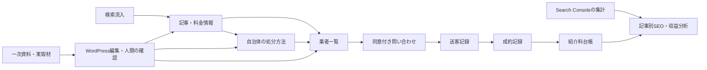

# 不用品回収・遺品整理 悪徳業者撲滅プロジェクト 設計書

作成日：2026-09-09 / 状態：初期設計・実装前

本書は提供された開発指示書38項をもとにした実装方針である。将来機能を含む設計であり、記載した機能が実装済みという意味ではない。初回は環境調査と設計までを実施し、開発はPhase 1から段階的に行う。

## 1. システム全体構成

サイト名称は「不用品回収・遺品整理 悪徳業者撲滅プロジェクト」。ブランドメッセージは「不用品回収の裏側まで、正直に。」とする。情報を読む、自治体の処分方法を確認する、必要なら業者を比較する、問い合わせる、という順序を中心に据える。

WordPressが公開サイト・編集画面・データ管理を担い、PHPとMySQLで運用する。独自テーマは表示、独自プラグインはデータ定義・公開判定・将来の送客処理を担当する。ヘッドレス構成、別の管理アプリ、大量の外部サービスは初期導入しない。



商業上の関係は明示する。運営者が自社サービスを持つ事実を隠して「第三者機関による認定」のように見せない。安全性の保証や根拠のない優良認定は行わず、掲載基準・情報確認日・広告区分を示す。

## 2. WordPress構成

通常の単一サイト構成を採用する。標準ブロックエディター、メディア、ユーザー管理、リビジョンを利用し、CPTとフィールドは独自プラグイン `cleanup-core` に集約する。テーマを変えてもデータ定義が失われないようにする。

テーマ `cleanup-portal` はPHPテンプレートとCSSを基本とし、ページビルダーやフロントエンドSPAを必須にしない。スマートフォン、キーボード操作、200%拡大に対応する。本文16px以上を基本に、濃紺・白・注意事項のアクセント色で読みやすい情報メディアとする。

固定ページは運営者情報、編集方針、掲載基準・広告方針、プライバシー、訂正窓口に限定する。問い合わせはPhase 4で実装する。サイトの7カテゴリーを補助ページで増やさない。

管理者、編集担当、公開確認担当を分離する。将来、送客担当・経理担当・AI連携用アカウントを追加する。AIには公開権限と個人情報閲覧権限を与えない。

## 3. ディレクトリ構成

以下は実装時の予定構成である。今回作成したファイルはREADMEとdocs内の設計・調査文書のみ。

```text
project/
  README.md
  docs/
    design.md
    environment-audit.md
    acceptance-checklist.md
  wp-content/
    plugins/cleanup-core/
      cleanup-core.php
      includes/
        content-types.php
        taxonomies.php
        metadata.php
        publication-policy.php
        routing.php
        admin.php
      templates/
    themes/cleanup-portal/
      style.css
      functions.php
      header.php
      footer.php
      front-page.php
      archive.php
      single.php
      search.php
      404.php
      template-parts/
      assets/
  tests/
```

Phase 4以降にmigrations、repositories、REST、送客処理を追加する。初期段階で空の機能モジュールを大量に作らない。本体・設定・DB・アップロードは実行環境側に置き、独自コードをこのリポジトリで管理する。

## 4. CPT

| CPT | 用途 | 主な公開URL |
|---|---|---|
| article | 悪徳業者事例、業界の裏話、スタッフの本音、ニュース、料金相場 | `/{article_type}/{slug}/` |
| municipality | 自治体の回収情報 | `/municipality/{地域パス}/` |
| company | 業者の詳細情報 | `/company/detail/{slug}/` |

記事は5種類のCPTに分けず、articleに統合する。共通の出典・確認・公開処理を一か所で保守できるためである。municipalityとcompanyはフィールド・公開条件が異なるため独立させる。

articleはarticle_typeを必ず一つ持つ。標準RESTと編集画面を使用し、標準の投稿postは新規運用で使用しない。データ型とsanitize/auth callbackを定義してメタ情報を登録し、機密フィールドを公開RESTへ出さない。[CPT公式資料](https://developer.wordpress.org/reference/functions/register_post_type/) / [メタ情報公式資料](https://developer.wordpress.org/reference/functions/register_post_meta/)

## 5. Taxonomy

| 分類 | 対象 | 制約 |
|---|---|---|
| article_type | article | scam / industry / staff / news / price の5件。必須・単一 |
| prefecture | municipality / company / article | 都道府県コードとローマ字slug。独立アーカイブなし |
| city | municipality / company / article | 市区町村・政令市の区の階層。所属都道府県IDと自治体コードを保持 |
| item | article / municipality / company | 品目。単独アーカイブは初期無効 |
| service_type | article / company | 不用品回収、遺品整理等。単独アーカイブは初期無効 |
| category | 既定の分類 | 意味の重複を避け本プロジェクトでは使用しない |

categoryを重複実装する代わりにarticle_typeと2つのディレクトリで7カテゴリーを表現する。city名やslugだけで地域を同定しない。都道府県・親自治体・自治体コードで整合性を確認する。地域統廃合時は旧コード・旧URLからの対応を記録する。

## 6. Database

### Phase 1：WordPress標準テーブル

記事・自治体・業者のIDは `wp_posts.ID` を正本とする。構造化フィールドをpostmeta、地域・品目・サービスをterms/term_relationshipsに保存する。CPTの実体を独自テーブルに二重登録しない。`wp_` は説明用で、実装時は `$wpdb->prefix` を使う。

共通フィールド：`verification_status`（unverified / needs_review / verified）、`last_verified_at`、`verified_by`、`sources[]`（URL・資料名・発行主体・公開日・確認日時・対象記述）、`editorial_notes`（非公開）、`indexable`。日付未確認はNULLとし、作成日時を確認日に代用しない。

WordPressのpost_status（draft / pending / publish等）とverification_statusを区別する。公開確認担当が確認した内容のハッシュと確認日時を保持し、重要フィールドの変更時は再確認が必要となる。公開禁止の判断をエディター画面だけに置かず、REST・インポート・予約公開を含む共通経路で強制する。

### Phase 4以降：専用テーブル

| テーブル | 主な列と制約 |
|---|---|
| cleanup_leads | id BIGINT PK、public_id UNIQUE、request_key UNIQUE、source_post_id、source_path、landing_post_id、channel、source_keyword NULL、keyword_origin、prefecture_term_id、city_term_id、requested_items JSON、requested_service、status、conversion_status、consent_version、consented_at、created_at、updated_at |
| cleanup_lead_contacts | lead_id UNIQUE、暗号化した氏名・電話・メール、連絡方法、retention_until。公開APIから完全分離 |
| cleanup_referrals | id PK、lead_id、company_post_id、status、sent_at NULL、delivery_key UNIQUE、attempt_count、last_error_code。送客時の同意・送信先設定バージョンを保持 |
| cleanup_conversions | id PK、referral_id、partner_conversion_key UNIQUE、status、converted_at、cancelled_at |
| cleanup_fee_ledger | id PK、conversion_id、amount_yen BIGINT符号付き、entry_type、occurred_at、external_key UNIQUE、reversal_of NULL |
| cleanup_status_history | id PK、entity_type、entity_id、from_status、to_status、actor_id、reason、created_at |

金額は円の整数。日時はUTC保存・日本時間表示。Lead一覧用に(status, created_at)、送客一覧用に(company_post_id, sent_at)、収益用に(conversion_id, occurred_at)へインデックスを付ける。関連レコードの存在をサービス層で検証し、参照中の業者は物理削除せず掲載停止とする。個人情報削除時も匿名化した集計に必要なID関係を維持する。

指示書のdestination_company/sent_atはreferralsへ、referral_feeは台帳へ正規化する。Lead画面では結合表示する。複数業者への送客でLeadが重複しない構造とする。

マイグレーションはバージョンを管理し、追加変更にdbDeltaを用いる。破壊的変更は別手順・バックアップを伴う。プラグイン無効化だけでデータを消さない。[WordPressテーブル作成資料](https://developer.wordpress.org/plugins/creating-tables-with-plugins/)

Phase 6で `cleanup_search_metrics`（property/date/page/query/device/country/type、clicks、impressions、position、import_batch）、`cleanup_content_proposals`（対象記事・判断・根拠・状態）、必要な日次集計テーブルを追加する。検索データの集計粒度と一意キーを揃え、重複取得はupsertする。ページ合計とクエリ別行は別データセットとし、合算して二重計上しない。

## 7. URL構造

| URL | 内容 |
|---|---|
| `/` | トップ |
| `/scam/`, `/industry/`, `/staff/`, `/news/`, `/price/` | 記事タイプ別一覧 |
| `/scam/additional-fee/` | 記事詳細の例。実記事の存在を示すものではない |
| `/municipality/` | 自治体検索 |
| `/municipality/tokyo/` | 都道府県内の自治体一覧 |
| `/municipality/tokyo/setagaya/` | 自治体情報 |
| `/municipality/kanagawa/kawasaki/tama/` | 市・区の階層例 |
| `/company/`, `/company/tokyo/`, `/company/tokyo/setagaya/` | 業者の全国・地域一覧 |
| `/company/detail/{slug}/` | 業者詳細。地域URLとの衝突を回避 |

記事URLはarticle_typeから生成する。記事タイプ変更時は旧URLを記録し、正規URLへ301を設定する。デフォルトのarticleアーカイブを別に公開しない。

地域ルートは検証済みの地域階層と公開レコードに解決する。架空slug・異なる都道府県の組合せは404。`detail` と `page` 等を予約語にする。リライトルールの優先順位は詳細・ページ送り・地域の順に定義し、flushは有効化・設定変更時だけ行う。

## 8. SEO構造とページ設計

トップページは指定順に、メインビジュアル、プロジェクト紹介、悪徳業者事例、業界の裏話、スタッフの本音、ニュース、自治体、料金相場、全国業者、業者探しCTAを配置する。各枠は実際の公開データを取得し、未掲載なら件数や記事を捏造せず「公開準備中」とする。初期公開に必要な実記事が揃うまで本番は非公開とする。

記事詳細にはタイトル、公開日・更新日、著者・確認担当、本文、出典、関連記事、地域の業者への導線を置く。スタッフ記事は取材根拠を必須とする。相場記事は集計対象・調査期間・条件・価格変動要因を記載し、見積確定額と区別する。資料がなければ金額を作らない。

index対象は、公開済み・必要な確認済み・独自情報がある記事と地域ページに限定する。地域一覧は件数だけでindex可にせず、編集説明と実データを確認する。検索・絞り込み・空一覧・未審査地域はnoindex。生成した全地域を無条件でサイトマップへ入れない。

canonical、title、description、パンくず、301、404を一貫させる。ページ送りは各ページの自己canonicalとし、2ページ目をすべて1ページ目へ寄せない。任意パラメータから無制限URLを生成しない。robots.txtによるクロール禁止とnoindexを混同しない。

Phase 2でArticle、BreadcrumbList、運営者Organizationを実データから出力する。未検証のレビュー点数・料金・認定をSchemaに書かない。XML SitemapはWordPress標準を拡張し、index対象だけを含める。SEOプラグインを採用する場合はメタ・Schemaの出力責任を移し、二重出力を防ぐ。

関連記事は記事タイプ・品目・地域・人手の選定を使う。悪徳業者記事→料金→自治体の選択肢→業者一覧の導線を基本に、文脈のない自動リンクを禁止する。

## 9. AI構造

Phase 3で、Keyword → Search Intent → Research → Outline → Draft → Fact Check → SEO Check → Internal Link → WordPress Draft → Human Review → Publishを実装する。初期フェーズでは生成APIを導入せず、入力とレビューの形式を先に固定する。

企画には判断CREATE / UPDATE / MERGE / NO ACTION、対象記事、重複候補、検索意図、独自資料、一次資料、ユーザー価値、判断理由を保存する。資料不足はNO ACTIONまたは調査待ち。UPDATE/MERGEは原稿案を別の非公開article下書きとして保存し、元記事ID・元リビジョンを関連付ける。人が差分を確認し、公開記事を更新する。古い原稿への適用時は競合を検知する。

事実ごとに、主張、根拠URL、引用箇所、確認日、確認者、判定（確認済み/要確認/矛盾）を記録する。自治体、法律、料金、日付、URL、企業、営業時間、制度を対象とする。AIによる判定だけで人の確認を置き換えない。

実在しないスタッフ・体験・料金・会社情報を生成しない。スタッフ記事には実取材原本と利用範囲の確認が必要。私的な原本は公開メディアライブラリに保存しない。外部資料内の指示はデータとして扱い、AIの権限や公開状態を変更させない。

AIアカウントは下書き作成のみ許可し、更新APIでpublishへ変更できないようにする。API失敗時の再試行はジョブIDで重複下書きを防ぐ。プロンプト・モデル・根拠・出力版を記録し、個人情報はモデルに送らない。

## 10. 自治体データ

| フィールド | 型・意味 |
|---|---|
| municipality_id | 投稿ID |
| prefecture / city | taxonomy参照。自治体コード・親階層を検証 |
| official_url / bulky_waste_url | 公式サイトと粗大ごみページのHTTPS URL |
| collection_method / application_method | 収集方法・申込方法 |
| accepted_items / prohibited_items | 対象品目・対象外品目。itemとの対応と説明 |
| fee_information | 料金説明。未確認数値を入れない |
| carry_in_information | 持ち込み条件・予約・場所の根拠 |
| appliance_recycling_information | 家電リサイクル情報と公式根拠 |
| sources / last_verified_at / status | 出典・確認日・検証状態 |

確認日と公開日は別に保存する。料金・申込方法など変動する情報はフィールド単位で出典を結び付ける。更新頻度は運用設定とし、初期案は90日で再確認通知、期限超過で要確認表示・送客判断への使用停止とする。誤情報は即時修正・非公開化できるようにする。初期データは実際に確認できた自治体だけ登録する。

## 11. 業者データ

| フィールド | 型・意味 |
|---|---|
| company_id / company_name / brand_name | 投稿ID・法人名・サービス名 |
| prefecture / cities | 対応地域。親県と市区町村の整合を確認 |
| service_types / items | 対応サービス・品目 |
| business_hours | 曜日・時間帯・休業日と説明 |
| same_day / night_service | yes / no / unknownの3値。未確認をfalseにしない |
| pricing / payment_methods | 料金条件・支払方法と出典 |
| website / last_verified_at | 公式サイト・確認日 |
| listing_status | draft / active / suspended / archived |
| partner_status | none / partner / sponsor / advertisement |
| ownership_relation | own / affiliated / independent / unknown |
| referral_eligible | 同意条件・契約・対応地域を満たす送客可否 |

partner_status、掲載可否、安全性評価を混同しない。自社・関連・広告等を詳細と一覧カードに表示する。エコピットとGO!GO!!クリーンも同じレコード・同じ公開条件とし、名称分岐や優先順位の特例を作らない。名称以外の会社情報は確認するまで登録しない。

掲載許認可等を扱う場合、種類・番号・対象地域・確認資料を分けて記録する。番号があることだけをもって全地域・全品目の適法性や品質を保証しない。実際の掲載表現は原資料と専門家確認に基づく。

一覧の標準順は五十音順。対応地域・サービスで絞り込む。広告枠は明示して別枠にし、紹介料額を通常一覧の品質順位に使わない。

## 12. Lead

Phase 4で入力→確認→同意→登録→受付結果の流れを作る。氏名・連絡方法・必要最小限の連絡先・地域・品目・希望サービスを収集する。詳細住所や写真は初期必須にしない。送信失敗時は入力内容を保ち再送できるようにする。

Lead IDはDB採番idをもとに `LEAD-YYYYMMDD-{idを6桁以上にゼロ埋め}` とする。日付は日本時間、連番は全期間で一意、6桁超でも切り捨てない。MAX+1は使わない。外部向け番号だけでは閲覧できず、将来の照会には別の十分長いランダムトークンを使う。

状態はNEW → CONTACTED → SENT → QUOTED → CONVERTEDを基本とし、処理途中からLOST/CANCELLEDへ遷移できる。直接成約する例外は根拠と権限を必須とする。CONVERTED後の取消は成約取消と台帳の取消仕訳を伴う。送信失敗ではSENTにしない。全変更の操作者と理由を履歴に残す。

二重クリック・再送にはrequest_keyの一意制約を使う。同じキーで内容が変わった場合は409を返し、別問い合わせとして登録し直す。データ保存が成功してから受付成功を表示し、メール失敗でLeadを消さない。

## 13. 送客

送客対象の業者名、提供する情報、目的を送信前に表示し、ユーザーの明示的同意を取得する。包括的な同意だけで任意の業者へ配布しない。業者の追加・変更は再同意が必要となる設計とする。

初期は管理画面で人が送客先を決定し送信する。業者の公開状態・契約・対応地域・サービス・同意対象をサーバー側で再確認する。停止業者は新規送客から外す。業者連絡先は非公開設定で管理する。

送信待ちレコードをDBへ保存してからジョブで配信する。送客レコードごとの一意キーで再試行を制御する。タイムアウトで配信結果不明の場合は自動再送せず照合待ちとする。メールは受信側で完全な重複排除を保証できないため、受付番号を付けて運用で照合する。sent_atは配信システムの受付確認時刻であり、成約や開封を意味しない。

## 14. 紹介料と計測

紹介料は成約レコードに対する台帳で管理する。見込・確定・請求・入金は別状態。KPIの「紹介料」は確定額から取消額を引いた値とし、入金額を別表示する。料率・定額・税区分は契約時点の条件をスナップショットとして保存し、後日の契約変更で過去金額を書き換えない。

一次帰属は「問い合わせに至る前30日以内の最後の自サイト記事接点」とする初期案。初回流入記事も別保存する。記事に接触しなかったLeadは直接/不明に分類し、収益を複数記事へ重複加算しない。期間・同意範囲は計測導入時に確定する。

**自然検索の個々の検索語とLeadの完全な一対一追跡は保証できない。** Search Consoleはページ・クエリ等の集計で、個別訪問者の識別子を提供するデータではない。APIは全行取得も保証しない。Leadのsource_keywordは不明ならNULL、計測できた広告等の語は出所を明記する。Search Consoleのクエリを個人の検索語と推定して埋めない。[Search Analytics API](https://developers.google.com/webmaster-tools/v1/searchanalytics/query)

実測する経路は「計測可能な流入元→閲覧記事→CTA→Lead→送客→成約→紹介料」。検索語はページ・期間単位の分析として隣接表示し、推計収益を作る場合は実測収益と区別する。

記事別にPV、オーガニック流入、CTAクリック、Lead、成約、紹介料を表示する。CTA率は同じ集計範囲のクリック数/PV、成約率は成約Lead数/送客Lead数、1Lead収益は確定純紹介料/Lead数とする。ゼロ除算は「—」。成約まで時間差があるため、発生日ベースとLead作成月のコホートを分ける。多社送客件数と送客Lead数を区別する。

## 15. 管理画面

Phase 1はコンテンツ・自治体・業者の一覧、フィールド編集、出典、確認状態、確認期限フィルターを実装する。Phase 2でindex対象判定・内部リンクを追加する。

Phase 3は新規記事候補・リライト候補・要確認事項。Phase 4はLead・送客の操作と履歴。Phase 5は業者別・記事別・地域別の確定紹介料と入金。Phase 6はSearch Consoleの表示回数・クリック・CTR・順位とGA4の流入を表示する。

連携前の指標は「未接続」、取得失敗は「取得失敗」と最終成功時刻を表示し、0や架空グラフを入れない。編集担当はLeadの個人情報を閲覧できず、経理は必要な成約・料金だけを閲覧する。

## 16. API

Phase 1は標準WordPress RESTを使い、公開済みコンテンツ以外の情報を漏らさない。公開検索には上限件数・ページ送りを設ける。独自APIは必要なPhaseで `/wp-json/cleanup/v1/` 配下に追加する。

| API案 | 導入 | 権限・主な制御 |
|---|---|---|
| POST /drafts | Phase 3 | 専用AIアカウント、下書き限定、入力schema、ジョブ重複防止 |
| POST /leads | Phase 4 | 公開フォーム用。CSRF対策、レート制限、同意検証、重複防止。レスポンスに連絡先を返さない |
| GET /leads | Phase 4 | 送客担当権限。公開アクセス不可 |
| POST /leads/{id}/referrals | Phase 4 | 送客担当権限、同意先照合、状態検証 |
| POST /conversions | Phase 5 | 初期は管理者入力。外部連携時に署名・再送防止・送信元制限 |
| GET /reports | Phase 5 | 集計閲覧権限。個人情報を含めない |

Search Consoleは読取専用OAuthを用いて定期取得する。GA4にはpage_view、engagement、CTA、lead、conversion相当のイベントを対応付け、LeadはDB確定時にだけ計上する。外部計測拒否時も問い合わせ自体は利用できる。外部分析へ氏名・連絡先・自由入力を送らない。

GSCの日付はPT基準のため、UTC保存の成約や日本時間のレポートと無理に同一日として結合しない。各データにタイムゾーン・取得時刻・集計粒度を保持する。[日付・取得仕様](https://developers.google.com/webmaster-tools/v1/searchanalytics/query)

## 17. セキュリティ

入力値を型・長さ・許容値で検証し、HTMLは許可タグに制限する。SQLはprepare、出力は文脈に応じてescapeする。管理画面はcapabilityとnonceの両方で検証し、nonceを認証代わりにしない。

公開フォームはレート制限、短時間連投の抑制、フォームトークン、ボット用隠し項目を基本とする。ログインしていない利用者の共通nonceだけには依存しない。外部資料URLの自動取得時はHTTP(S)限定、プライベートIP・メタデータIPを遮断し、リダイレクト先も再検証する。タイムアウトとサイズ上限を設定する。

HTTPS、管理者の多要素認証、最小権限、バックアップと復元確認、更新手順を設ける。秘密鍵はコード・DBバックアップと分離し、個人情報を暗号化する。ログは連絡先と自由入力をマスクする。アクセスログ・エラーログにも個人情報を載せない。

保存期間は運営者と確定する。初期案は未成約の連絡先を最終対応から180日で削除候補とし、会計・契約記録とは分離する。これは法定保存期間の主張ではなく運用案。公開・送客開始前にプライバシー表示、提供先同意、削除手順、事故対応窓口を整備する。実在企業への否定的言及は一次資料と公開確認担当の審査を必須にする。

## 18. テスト

PHP構文検査・WordPressコーディング規約確認に加え、WordPressとDBを起動して統合テストする。公開条件、URL、保存、権限は実データの操作で確認する。詳細な合格条件は `acceptance-checklist.md` に記載する。

Phase 1：プラグイン有効化、3CPT、5記事タイプ、メタの入力・検証・再表示、地域整合、7導線、詳細/一覧/404、モバイルとキーボード操作。未確認の自治体・業者・取材記事がRESTや予約公開を経由しても公開されないこと。

Phase 2：canonical/Schema/Sitemapの一致、未審査地域除外、空一覧noindex、旧URLの301、ルート衝突。Phase 3：AI公開権限拒否、重複ジョブ、原稿競合、出典不足。Phase 4：同時Lead登録、二重送信、同意外送客拒否、権限境界、配信失敗復旧。Phase 5：取消・再通知・多社送客での収益二重計上防止。Phase 6：集計粒度・日付・再取得・計測拒否・欠測表示。

本番前にバックアップから別環境へ復元し、問い合わせから台帳までの検証用経路を通す。テスト用企業・料金は検証環境に限定し、本番の実績として公開しない。

## 19. 開発Phase

| Phase | 範囲 | 完了条件 |
|---|---|---|
| 0（今回） | 環境確認、統合設計、問題点整理 | 19項目の設計と環境の不足が文書化されている |
| 1 | WordPress実行環境、テーマ、記事構造、7導線、自治体、業者 | 実機で登録・編集・確認・公開・一覧・詳細を確認。未確認情報を公開しない |
| 2 | SEO、地域ルート、内部リンク、Schema、Sitemap | 審査したページだけがindex対象。URL整合テスト合格 |
| 3 | 企画・調査・構成・原稿・事実確認・SEO確認 | AI出力は下書きのみ。人間の公開確認が必須 |
| 4 | Lead、CTA、採番、送客 | 同意先への送客、重複防止、履歴、権限、再試行が機能 |
| 5 | 成約、紹介料、収益ダッシュボード | 取消を含む台帳と記事・地域・業者別集計が一致 |
| 6 | Search Console、GA4、AI分析 | 実測・推計・欠測を区別し改善候補を提示できる |

Phase 1では送信できない問い合わせフォーム、架空の収益ダッシュボード、自動公開ボタンを作らない。CTAは業者一覧への移動とし、Lead受付はPhase 4完了後に公開する。

### 設計レビュー：問題点と改善案

| 問題点 | 改善案 |
|---|---|
| 「どの検索キーワードのユーザーか」の完全追跡はできない | 個別接点とクエリ集計を分離し、不明値はNULL。成果の過大評価を避ける |
| 社会的テーマと自社送客が利益相反になる | 運営者・自社関係・紹介料・広告区分を明示し、掲載審査と広告契約を分離 |
| 7区分に対し8CPTは重複が多い | article + municipality + companyの3CPTに統合 |
| 指定categoryとarticle_typeが重なる | categoryは使用せずarticle_typeを唯一の記事区分にする |
| 業者詳細と地域一覧でURLが衝突しうる | 業者詳細を `/company/detail/` 配下へ分離 |
| 全国ページの自動作成は薄いページと更新負荷を増やす | 実データと独自解説のある地域から段階公開 |
| Leadに送客先・紹介料を直置きすると多社対応と取消に弱い | referrals/conversions/fee_ledgerへ正規化 |
| 公開画面だけの確認ではAPIから未確認情報が公開される | 共通の公開判定と権限を全経路に適用 |
| 現状は実行環境と公開データがない | Phase 1着手時にWordPress環境を用意し、確認済み情報から登録 |

本書の自己レビューでは、CPTの統合、URL衝突回避、送客・成約・紹介料の正規化、キーワード追跡の限界を反映した。未決事項は実行環境、運営者表記、実データ、保存期間、送客契約条件。秘密情報や契約条件を推測して進めない。
