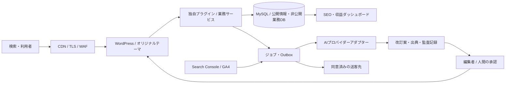

# 全国不用品回収SEO情報ポータル システム設計書

版: 1.0 / 作成日: 2026-09-05 / 状態: PHASE 1設計成果物

## 設計の前提と環境調査

基本思想は「不用品回収の裏側まで、正直に。」。消費者保護、業界の裏側、スタッフの本音を編集の中核とし、最重要KPIをSEOコンテンツ由来の紹介料とする。紹介料と自社ブランド属性は利用者向けの順位計算に入れない。

初回調査では作業フォルダに `.git` のみを確認。Gitの変更・remoteの出力はなし。WordPress本体、テーマ、プラグイン、DB設定、Hosting設定、REST API接続情報は未提供。PHP・MySQL・DockerはPATH上で検出されず、Git・Nodeは検出された。関連する環境変数は名前だけを確認し、対象名は検出されなかった。インストール先を網羅的に調査した結果ではない。本番システムの有無・接続性は未確認。本番への変更は行わない。

本書は設計であり、稼働済み機能や接続済みAPIを表すものではない。バージョンは実装開始時にサポート期間とホスティング互換性を確認し固定する。実在する料金、事例、発言、許認可、対応地域をサンプルとして創作しない。

## 1. 全体アーキテクチャ



公開CMSと業務トランザクションは論理分離する。WordPressを唯一の公開元とし、AIは公開権限を持たない。送客は保存・同意・割当の後に非同期配信する。個人連絡先は公開コンテンツや分析イベントに渡さない。

## 2. システム構成

初期は単一WordPress、MySQL、定期実行ワーカー、画像ストレージで開始。Web側の同期処理は閲覧、入力検証、保存、ジョブ登録まで。生成・外部取得・配信・集計はワーカーが担当する。ステージングと本番はDB、APIキー、ストレージ、送信先を分離する。

Redis等のオブジェクトキャッシュとCDNは計測後に導入。公開ページだけをキャッシュし、管理画面、プレビュー、フォームセッション、個人情報APIはキャッシュしない。DBバックアップと画像を別管理し、復元訓練を行う。暫定目標はRPO24時間・RTO4時間とし、送客稼働前に事業要件に応じて短縮する。

## 3. WordPress構成

テーマ `honest-portal` は表示だけを担当。プラグイン `portal-core` はCPT、Taxonomy、メタスキーマ、業務DB、REST、公開審査、SEO、Cron、AIアダプターを担当する。テーマ変更で業務データを失わない。

編集者、一次情報確認者、公開承認者、送客担当者、経理担当者、システム管理者、AIサービスユーザーを権限で分離する。AIは下書き作成と自分のジョブ更新だけを許可する。公開済み記事の編集は別改訂案に保存し、承認時にリビジョンを残して反映する。

CPTの登録はプラグインで行い、権限を明示的に割り当てる。[WordPress公式CPTガイド](https://developer.wordpress.org/plugins/post-types/registering-custom-post-types/)

## 4. ディレクトリ構成

以下は実装時の予定構造。現時点で存在するコードを意味しない。

```text
docs/                    設計、運用、API、受入条件
wordpress/wp-content/
  plugins/portal-core/
    portal-core.php
    src/Content/          CPT・Taxonomy・公開制御
    src/Database/         移行・Repository
    src/Rest/             認証・検証・API
    src/AI/               Agent・Provider・品質ゲート
    src/Leads/            同意・割当・配信
    src/Revenue/          契約・台帳・集計
    src/Analytics/        GSC・GA4
    src/Admin/            管理画面
    src/Jobs/             再実行可能なバッチ
    prompts/v1/          バージョン固定プロンプト
  themes/honest-portal/
    functions.php / style.css / index.php
    single-{article,area,municipality,item,case,company,price,interview,faq}.php
    archive-{area,company}.php
    template-parts/       パンくず・出典・CTA・広告開示
    assets/               CSS・必要最小限のJS
tests/                    unit・integration・e2e
infra/                    ローカル環境・CI・デプロイ定義
```

## 5. CPT設計

| CPT | 役割 | データ正本・公開条件 |
|---|---|---|
| article | 業界・消費者保護・ニュース等 | 本文はposts、主カテゴリーを1つ選択 |
| area | 都道府県→市区町村→行政区 | 階層型、area_id参照、独自価値審査必須 |
| municipality | 自治体公式案内 | municipality_id参照、出典・確認状態必須 |
| item | 品目別処分案内 | item_id参照、適用条件と根拠を表示 |
| case | 実際の回収事例 | case_id参照、匿名化と掲載同意の確認 |
| company | 事業者情報 | company_id参照、最終確認日と掲載関係を表示 |
| price | 料金の解説 | 根拠・期間・税込区分・適用条件必須 |
| interview | 実発言の編集記事 | interview_id参照、本人確認済みの原文必須 |
| faq | 再利用するQ&A | 原則単独公開なし、掲載先の本文に表示 |

Partner、Lead、契約、料金台帳、個人連絡先は公開CPTにしない。投稿IDと業務IDを混用しない。本文と公開ステータスはpostsが正本で、業務テーブル内のpublication_statusは照会用の派生値とする。更新失敗時は公開を止め、同期修復ジョブに回す。

## 6. Taxonomy設計

| 論理名 | 登録名 | 対象・用途 |
|---|---|---|
| area | portal_area | CPT areaとの識別衝突を避ける地域分類 |
| prefecture | prefecture | 全コンテンツの都道府県絞込み |
| city | city | 市区町村コードを保持。名前だけで結合しない |
| item_category | item_category | item・case・articleの品目分類 |
| article_type | article_type | industry、anti-scam、staff、disposal、price、company、news |
| content_tag | content_tag | 横断的な関連付け |
| service_type | service_type | 回収・買取等の対応サービス |

初期はTaxonomyの公開アーカイブとrewriteを無効化。地域CPTや編集ハブのみをindex可能にして重複URLを抑える。termから地域マスタIDへ対応付け、自治体名変更時もIDを維持する。

## 7. Database Schema

テーブル名の `p_` は実装時に `{$wpdb->prefix}portal_` に置換。IDはBIGINT UNSIGNED、時刻はUTC DATETIME、表示はAsia/Tokyo。金額はJPYの整数円、割合はbasis points（10000=100%）。不明値はNULLとし、0円・falseと区別する。URLはHTTPSを原則とし最大2048文字、状態はVARCHAR(32)＋アプリ側許容値検証。JSONは構造検証し、検索に使う多値関係は中間テーブルへ正規化する。

| テーブル | 主な列・制約 | 主要索引 |
|---|---|---|
| p_areas | id PK, parent_id, kind, code, slug, name, canonical_path | UNIQUE(code), UNIQUE(canonical_path), parent_id |
| p_municipalities | id PK, area_id, post_id, 12節の属性 | UNIQUE(area_id), UNIQUE(post_id), verification_status,last_verified_at |
| p_items | id PK, post_id, 13節の属性 | UNIQUE(post_id), category |
| p_cases | id PK, post_id, area_id, 14節の属性 | UNIQUE(post_id), area_id,created_at |
| p_interviews | id PK, post_id, 15節の属性 | UNIQUE(post_id), verified_by_staff,verification_date |
| p_companies | id PK, post_id, 16節の属性 | UNIQUE(post_id), status,last_verified_at |
| p_partners | id PK, company_id, 17節の属性, version | company_id,active_status |
| p_partner_areas | partner_id, area_id, include_descendants | PK(partner_id,area_id), area_id |
| p_partner_items | partner_id, item_id | PK(partner_id,item_id), item_id |
| p_partner_services | partner_id, service_type_id | PK(partner_id,service_type_id) |
| p_case_items | case_id, item_id, quantity | PK(case_id,item_id) |
| p_item_relations | item_id, related_item_id, relation_type | PK(item_id,related_item_id,relation_type) |
| p_sources | id PK, url, publisher, source_type, checked_at, content_hash, verification_status | verification_status,checked_at |
| p_content_sources | post_id, source_id, claim_key, excerpt_reference | post_id, source_id |
| p_leads | id PK, public_id, idempotency_key, 18節の属性, version | UNIQUE(public_id), UNIQUE(idempotency_key), status,created_at; source_post_id,created_at |
| p_lead_contacts | lead_id PK, encrypted_payload, key_version, expires_at | expires_at |
| p_lead_items | lead_id, item_id, quantity | PK(lead_id,item_id) |
| p_assignments | id PK, lead_id, partner_id, status, reservation_expires_at, sent_at | lead_id,status; partner_id,status |
| p_partner_usage | partner_id, month_jst, reserved_count, sent_count | PK(partner_id,month_jst) |
| p_lead_events | id PK, lead_id, event_type, actor_id, occurred_at, payload | lead_id,occurred_at |
| p_referral_contracts | id PK, partner_id, version, 19節の条件 | UNIQUE(partner_id,version), effective_from |
| p_fee_ledger | id PK, lead_id nullable, partner_id, contract_id, event_key, amount_yen, entry_type, status, period | UNIQUE(event_key), partner_id,period; lead_id |
| p_generations | id PK, post_id, model, provider, prompt_version, source_data, generated_at, reviewed_by, reviewed_at, quality_score, publication_status, input_hash | post_id,generated_at |
| p_revisions | id PK, post_id, generation_id, base_hash, proposed_content, diff, review_status | post_id,review_status |
| p_keywords | id PK, keyword, intent, area_id, item_id, category, search_priority, page_type, current_position, impressions, clicks, ctr | area_id,item_id; search_priority |
| p_content_decisions | id PK, keyword_id, decision, target_post_id, evidence_json, reviewer_id | decision,created_at |
| p_gsc_daily | property_id, date, page_hash, query_hash, device, country, search_type, page, query, impressions, clicks, position | UNIQUE(全ディメンション), date,page_hash |
| p_ga_daily | property_id, date, page_hash, channel, event_name, count | UNIQUE(全ディメンション) |
| p_jobs | id PK, job_type, dedupe_key, payload, state, attempts, available_at, locked_until, last_error | UNIQUE(dedupe_key), state,available_at |
| p_outbox | id PK, assignment_id, dedupe_key, state, attempts, next_attempt_at, acknowledged_at | UNIQUE(dedupe_key), state,next_attempt_at |
| p_audit_log | id PK, actor_id, action, entity_type, entity_id, redacted_diff, created_at | entity_type,entity_id; created_at |

各実体にcreated_at、updated_atを付与。独自テーブル間の参照整合性はRepositoryで検証し統合テストで保証する。業務履歴は物理削除を通常操作にしない。InnoDBトランザクション内でLead・割当・台帳を変更し、失敗時はロールバックする。postsやtermsの削除は業務参照があれば拒否または明示的なアーカイブにする。

DB移行はschema_version付きで追加変更を原則とし、バックアップ→ステージング検証→本番承認→適用。プラグイン無効化・削除でテーブルを自動DROPしない。URL移行・本番DB構造変更はユーザー指定どおり実行前に停止して報告する。

## 8. URL設計

| 公開URL | 正本 |
|---|---|
| /industry/、/anti-scam/、/staff/、/disposal/、/price/、/company/、/area/、/case/、/municipality/、/news/ | 各カテゴリーの編集ハブまたはCPTアーカイブのいずれか1つ |
| /industry/{slug}/、/anti-scam/{slug}/、/news/{slug}/ | 主カテゴリーが一致するarticle |
| /staff/{slug}/ | interview。一般記事は /staff/guide/{slug}/ |
| /disposal/{item-slug}/ | item。一般記事は /disposal/guide/{slug}/ |
| /price/{slug}/ | price |
| /area/{prefecture}/{city}/{ward}/ | 階層型area。市・区は存在する階層だけ |
| /municipality/{municipality-id}/ | municipality |
| /case/{slug}/ | case |
| /company/detail/{company-id}/ | companyの個別ページ |
| /company/{prefecture}/、/company/{prefecture}/{city}/ | 審査済み地域比較ハブ |

同名市衝突を避け、/company/{city}/ は新規採用しない。既存URLが後から判明した場合は衝突調査と移行表を作る。company一般記事は /company/guide/{slug}/。guide、detail、page、feedを予約語にする。未知階層や不正な親子関係は404。カテゴリー変更時は旧URL→新URLの1段301を明示登録し、多段転送を避ける。絞込みパラメータから静的地域×品目ページを自動生成しない。

## 9. SEO構造

ページ候補には検索意図、需要の根拠、既存一致ページ、独自情報、自治体情報、事例、実発言、独立価値を記録する。需要不明を高需要扱いしない。

| 判定 | 条件 |
|---|---|
| DO_NOT_CREATE | 根拠不足・独立価値なし・需要未検証。調査待ちも含む |
| MERGE | 同じ意図の既存ページが複数。統合先と301計画をレビュー |
| UPDATE_EXISTING | 同じ意図の既存ページがあり情報更新で解決 |
| ADD_SECTION | 既存ページの一節で十分に回答できる |
| CREATE_PAGE | 需要・独自根拠・独立価値があり既存ページでは解決できない |

判定は上から検討し、AIの提案に人が根拠を確認する。公開は人間承認、出典確認、重大Fact Check未解決ゼロ、独自価値確認、SEO80点以上を必須にする。80点は本プロジェクトの基準であり検索順位の保証ではない。[Googleのスパムポリシー](https://developers.google.com/search/docs/essentials/spam-policies)

title、description、OG、canonical、パンくずは単一のSEO出力サービスで生成。index可能かつ200の正規ページだけをXML Sitemapへ登録し、lastmodは実質更新時のみ変更。検索結果、組合せフィルター、未審査ページはnoindex。robots.txtだけでnoindexを代替しない。ページネーションは各ページを自己canonicalにする。

Article、BreadcrumbList、WebSite、Organizationを該当ページへ出力。LocalBusinessは実在・確認済みの企業情報に限定。FAQPageは可視本文のQ&Aのみを対象とする拡張候補で、検索上の特別表示を導入目的にしない。構造化データを二重出力しない。将来の多言語版は実在する翻訳と相互参照が整った場合だけhreflangを導入する。

## 10. AI Agent構成

| Agent | 入力 | 出力・責任 |
|---|---|---|
| Keyword | GSC・編集調査・品目地域ID | 意図と需要の根拠、既存候補 |
| Research | 承認済み調査対象 | 出典URL・確認日・根拠箇所・矛盾一覧 |
| Content Planner | 検索意図・出典・既存ページ | 5種の判定と構成案 |
| Writer | 承認構成・検証可能な根拠 | 主張と出典の対応付き本文案 |
| Fact Checker | 本文案・根拠 | 主張単位のverified / needs_review / rejected |
| SEO Auditor | 本文・意図・重複・メタ | 0〜100点と項目別根拠 |
| Internal Link | 公開済み地域・品目・事例等 | 関連性の理由付きリンク候補 |

Providerは `generateStructured(input, schema, timeout)` 契約で差し替える。AI_PROVIDER・AI_MODEL・AI_API_KEYは環境変数から取得。キー未設定時は明示的に無効。プロンプトはファイルで版固定し、ハッシュ・モデル・provider・生成日時・費用・入出力参照を記録。タイムアウト、出力スキーマ検証、利用上限、指数バックオフを実装する。Fact Checkerによる自己申告を検証完了扱いしない。

SEO配点案: 意図15、独自性15、一次情報15、正確性15、情報量5、可読性5、内部リンク5、タイトル5、見出し5、メタ3、Schema2、重複5、利用者価値5=100。重大な誤りは点数に関係なく停止。

## 11. AIデータフロー

Keyword→意図判定→Research→構成→Writing→Fact Check→SEO Audit→Internal Link→WordPress下書き→人間レビュー→公開。各段階をジョブとして保存し、失敗段階から再開できる。最終本文ハッシュを承認記録へ結び、承認後の変更は再承認に戻す。

リライトはKEEP / UPDATE / EXPAND / MERGE / REMOVEを提案。REMOVEは削除の自動実行を意味しない。差分とbase_hashを保存し、原稿がその後編集されていたら競合扱いとする。公開権限を持つ人が差分を確認する。外部ページ内の指示はデータとして扱い、ジョブやツール権限を変えさせない。

## 12. Municipality DB

municipality_id=内部ID、prefecture・city=地域参照、official_name=正式名称、official_url・bulky_waste_url=公式URL、application_method・collection_method=構造化説明、carry_in_available=三値boolean、fee_information・prohibited_items・appliance_recycling_information=出典付きJSON、last_verified_at・source_checked_at=日時、verification_status=unverified / verified / needs_review / rejected、source_url=主出典。複数出典はp_sourcesへ保持する。

公式ページの取得成功と内容の確認は別。HTTP200だけでverifiedにしない。暫定90日で再確認期限、料金等の重要変更は即時に要確認。掲載時に出典と最終確認日を表示し、期限切れは要確認の表示を付ける。AIが未確認料金を補完しない。行政再編はareaコードの有効期間と旧新対応を保存する。

## 13. Item DB

item_id、item_name、category、sub_category、disposal_methods、municipal_disposal、appliance_recycling、recycle_possible、resale_possible、difficulty、related_items、legal_notes、updated_atを保持する。方法・法的注意は根拠参照付きJSON、可否は不明を許す。related_itemsは中間テーブル。自治体で異なる条件はitemの全国共通値に上書きせず、自治体別ルール（municipality_id,item_id,conditions,source_id,checked_at）へ分離する。

## 14. Case DB

case_id、prefecture、city、area、floor_plan、purpose、items、volume、workers、duration、price、staff_comment、images、created_at、publication_statusを保持。priceは整数円＋税込区分・作業日・追加条件、durationは分、volumeは数値＋単位。情報不明は空欄にする。

正確な住所・氏名・電話番号を入力項目に置かない。自由文と画像も掲載前に確認し、EXIF位置情報、表札、車両番号、顔、伝票を除去・マスクする。撮影元・掲載同意確認・確認者を記録。公開のためにLeadの連絡先をコピーしない。実写・図解・生成画像の種別を保持し、実績写真を生成画像で代用しない。

## 15. Staff Interview DB

interview_id、staff_role、question、answer、source_reference、verified_by_staff、verification_date、publication_status、published_atを保持。原文は改変履歴を残す非公開ソース、編集後本文はCPTに分離する。AIは実際の回答の整理だけを行う。原文参照なし、本人確認なし、掲載許諾なしは公開不可。編集後の意味が変わる場合は再確認する。個人名を必要としない役割名表示を標準とする。

## 16. Company DB

company_id、company_name、service_name、area、prefectures、municipalities、service_types、business_hours、pricing、payment_methods、same_day、night_service、purchase_service、license_information、website、review_information、advertisement_plan、referral_plan、status、last_verified_atを保持。

地域・サービスは中間テーブル、営業枠は曜日・開始終了・例外日のJSON、許認可は種類・番号・対象範囲・発行主体・確認URL・確認日の配列。許認可の存在だけで全サービスの適法性を一括断定しない。review_informationは出典・件数・取得日・利用許諾を持つ。広告契約と紹介契約は非公開業務DBへの参照にし、公開RESTに契約額を返さない。

## 17. Partner DBとマッチング

partner_id、company_id、brand_name、partner_type（internal / external）、supported_prefectures、supported_cities、supported_items、service_hours、same_day、night_service、minimum_price、referral_fee、referral_fee_type、monthly_lead_limit、current_capacity、active_statusを保持。紹介料条件は版付き契約を正本とし、Partner上の値は現在契約の参照。対応サービス・例外日・品質確認情報を追加する。

エコピットとGO!GO!!クリーンも同じ登録フォームとロジックを使う。確認前はinactiveで、対応地域や料金を推測登録しない。

候補抽出は地域、全依頼品目、サービス、希望日時、即日・夜間条件、有効な受付枠、月次上限を必須フィルターにする。未確認条件は一致扱いにしない。該当なしの場合は該当なしと表示し、手動相談へ誘導する。

順位は条件適合度、確認済み対応品質、評価の信頼度、十分な件数のある成約実績に基づく版付き説明可能ルールとする。初期は比較できる実績がないためランキングを出さず、条件一致一覧として表示する。同条件の順序は透明な輪番。紹介料・自社属性・広告料を順位特徴量にしない。掲載基準、更新日、紹介料発生、スポンサーを表示する。

割当時はpartner_usage行をロックして上限と予約数を再確認し、予約とassignmentを同一トランザクションで保存。期限切れ予約を解放する。表示時の空きだけで送信しない。

## 18. Lead DB・REST API

lead_id、source_page、source_keyword、prefecture、city、area、requested_service、requested_items、preferred_date、preferred_time、destination_partner、sent_at、status、converted、conversion_value、referral_fee、created_atを保持。source_pageはcanonicalとpost_id、source_keywordは本人入力や取得可能なキャンペーン値だけ。自然検索の個人別クエリは取得できたものと扱わない。

連絡先、連絡手段、同意文書版・同意日時・同意した送客先、保管期限を追加。連絡先は暗号化して別テーブルへ保存し、業務DBの公開API・ログ・GA4へ出さない。保管期限は暫定90日とし、会計記録とは別に運用開始前に決定する。

公開IDは `LEAD-YYYYMMDD-000001` 形式。日付はJST、日次シーケンスをトランザクションで採番しUNIQUE制約と再試行で重複を防ぐ。これは照会認証トークンではない。利用者向け照会は別の十分な長さの乱数トークンをハッシュ保存して有効期限を設ける。

状態: received→consented→matched→dispatch_pending→sent→quoted→converted / lost / cancelled。配信失敗はdispatch_failedで再試行。送客状態と紹介料確定状態は別管理。成約取消時は履歴と台帳反対仕訳を追加する。

| API / portal/v1 | 認可 | 主要動作 |
|---|---|---|
| GET /municipalities、/items、/companies | 公開 | 確認済み公開フィールドのみ・ページング |
| POST /matches | 公開・レート制限 | 条件検証、候補と一致理由。個人情報不要 |
| POST /leads | 公開・同一オリジン検証・レート制限 | 同意、必須連絡先、idempotency key検証、保存 |
| GET /leads/{id} | 担当権限または期限付き照会トークン | 最小限の進捗。連番だけでは取得不可 |
| POST /leads/{id}/assign | 送客担当 | 同意先・枠・version検証、Outbox登録 |
| POST /leads/{id}/events | 担当者または署名済みPartner | 状態遷移・event IDで重複排除 |
| POST /generations | AI用権限 | 下書きジョブのみ |
| POST /revisions/{id}/approve | 公開承認者 | hash・根拠・品質ゲート検証 |
| GET /dashboard | 分野別管理権限 | 集計済み値 |

入力不正400、未認証401、権限なし403、非存在404、競合409、制限429、外部障害503を使い分ける。メール・Webhook送信は同意後、Outboxから実施。相手の受付確認後にsentにする。タイムアウトでは成功不明として照合し、無制限に重複送信しない。新たな送客先は再同意が必要。

## 19. Referral Fee DB

契約にはpartner_id、version、有効開始終了、fee_type、単価円、率bps、税込区分、端数処理、発生条件、取消条件、月額円、上限、備考を保存。lead / conversion_fixed / conversion_percent / monthly / otherに対応。otherは手動根拠必須で自動計算しない。

送客時に契約版を固定。Lead単価は契約で定義した送客受領イベント、成約単価・割合は確認済み成約イベントで計上する。割合例は `floor(conversion_value_yen * rate_bps / 10000)`、丸め方は契約に固定。月額はpartner×契約×年月で一度だけ計上し、各Leadに全額を複製しない。

台帳は予定・確定・請求・入金を分離。再送イベントはUNIQUE event_keyで二重計上を防止し、取消・訂正は負数の調整行。convertedとfee_finalizedを同じ状態列にしない。記事別収益は確定台帳のLead起点だけを集計。月額契約は別枠表示し、配賦するならルールを明記して総額と照合する。

## 20. CTA

記事、地域、品目、事例に応じて「対応可能な業者を確認する」等を表示。事例からはarea_id、item_id、間取り、source_post_id、cta_idを許容リストで引き継ぐ。本文内の位置・ラベルは編集可能だが送信先URLを自由入力させない。

利用者は地域→品目・日時→候補と掲載関係の説明→連絡先→送客先を明示した同意→受付番号の順に進む。自動選択した別業者へ無断送信しない。問い合わせ成功はサーバーで保存成功した場合のみ表示する。バックエンド未接続時は受付できる表示を出さない。

## 21. Search Console

OAuth等の認証情報は本番用に別設定し、プロパティ所有者のアクセスを利用する。query、page、impressions、clicks、ctr、position、dateに加えdevice・country・search_type・取得日時を保持する。ページURLをcanonicalへ対応付け、元URLも保持。

日次取得はページング・クォータ制御・重複排除を行い、暫定値の再取得窓を設ける。CTRは合計clicks / 合計impressions、positionはimpressionsで加重平均。匿名化・欠損・取得範囲の制約を明示し、GA4セッション数との一致を前提にしない。クエリを個別Leadに結び付けない。[API利用制限](https://developers.google.com/webmaster-tools/limits)

順位・CTR変化は比較期間と最低母数を設定し、季節性や掲載位置変化を確認してから改訂案にする。API接続前の数値は未接続表示とし、架空のダッシュボード実績を入れない。

## 22. GA4

page_view、session、engagement、cta_click、generate_lead、conversionを設計対象とする。cta_id、source_post_id、公開地域ID等の非個人情報だけを送る。連絡先・正確な住所・生のLead ID・自由文を送信しない。フォームURLのクエリにも個人情報を置かない。

計測同意の状態に従って送信し、同意がなくても必要な問い合わせ受付はできるようにする。業務DBをLead・成約・収益の正本にする。GSCはGSCの日付、GA4はプロパティのタイムゾーン、業務集計はJSTで保持し、横断比較では日付境界を明記する。

## 23. AI SEO Dashboard

編集タブ: 新規・更新・統合・削除候補、根拠、対象記事、品質点、未解決Fact Check、自治体確認期限。SEOタブ: 検索表示、クリック、CTR、平均順位、セッション、CTA。業務タブ: Lead、送客、見積、成約、未成約、成約率。収益タブ: 確定紹介料、Partner別・地域別・記事別、月額別枠、取消調整。

各指標に期間、定義、最終同期時刻、欠損・未接続状態を表示する。成約率は成約数÷送客済Lead数を基本とし、送客日コホートと成約発生日集計を区別。記事別は最初に問い合わせを生んだsource_post_idで固定する。運用上の再割当やURL変更で過去の起点を変えない。

## 24. Cron

| 頻度 | ジョブ | 失敗時 |
|---|---|---|
| 数分ごと | Outbox、AI処理、予約期限解放 | ロック期限・指数バックオフ・上限後手動対応 |
| 毎日 | GSC再取得、KW変化、自治体期限、Lead集計 | 日付単位の冪等再実行 |
| 毎週 | 新規・リライト・内部リンク・低品質候補 | 候補保存まで。公開や削除はしない |
| 毎月 | SEO・Partner・紹介料・地域・記事レポート | 対象月を固定、改訂版番号を保持 |

本番はアクセス頼みの実行を避け、サーバーの定期実行からWordPressジョブを起動する予定。排他ロック、有効期限、heartbeat、最大試行回数、dead letterを持つ。月次はJST月初に前月を処理し、単純な30日間隔にしない。これはアプリ内の設計であり、Codexの定期タスクを登録する依頼ではない。

## 25. Security

管理画面の変更はnonceとcapabilityの両方を検証。nonceを認証の代替にしない。RESTはpermission_callbackとオブジェクト単位の権限チェックを必須にし、Partnerは自分に割り当てられたLeadだけを操作できる。

型・長さ・許容値の入力検証、sanitize、出力コンテキスト別escape、wpdbのprepared statementを使用する。動的SQL識別子は許容リスト。HTMLは許可タグだけ。AIによるHTMLにも同じ制限を適用する。

公開フォームは同一オリジン検証、レート制限、ハニーポット、必要時CAPTCHA、冪等キーを併用。非ログインnonce単独に依存しない。外部URL取得はHTTPSと許可ホストを基本に、localhost・プライベートIP・メタデータIPを拒否し、DNS解決後とリダイレクト先も再検証。サイズ・時間・リダイレクト数に上限を設ける。

秘密は環境変数または秘密管理サービス。連絡先暗号鍵はDBと分離し版付きでローテーション。ログには本文・キー・連絡先を残さない。監査ログに操作主体・対象・時刻・秘匿化した差分を記録。バックアップにも同じアクセス制限と保管期限を適用する。

## 26. Testing

| 対象 | 受入条件 |
|---|---|
| PHP / lint | 全PHP構文検査、WordPress coding standards、静的解析 |
| CPT / REST | 登録9種、型検証、編集権限、匿名アクセスの非公開情報除外 |
| 公開ゲート | 79点、未確認発言、未解決根拠、承認後改変、AIユーザー直接publishを拒否 |
| URL / SEO | 同名市・階層不正404、単一canonical、二重Schemaなし、noindexとSitemap整合 |
| マッチング | 地域・全品目・日時・例外日・夜間・容量不一致を除外、自社/紹介料変更で順位不変 |
| Lead | 同時採番重複なし、同時割当で上限超過なし、二重クリック1件、同意外送客拒否 |
| 配信 | 相手タイムアウト、再試行、重複Webhook、成功不明時の照合 |
| 紹介料 | 各方式、端数、月額二重計上防止、取消調整、契約改訂後も過去額固定 |
| 分析 | 0除算、欠損、加重平均、JST月境界、集計合計と台帳の一致 |
| Security | CSRF、XSS、SQL injection、IDOR、SSRF、署名リプレイ、PII漏れを検証 |
| UI / 性能 | モバイル・キーボード・ラベル・エラー案内、遅延画像、公開キャッシュ動作 |
| 復元 | バックアップを隔離環境へ戻し、投稿・業務参照・画像の整合性確認 |

テストデータは明示的に架空とラベル付けし、本番公開不可とする。毎Phaseで可能な検証を実行し、実施済み・失敗・環境不足で未実施を分けて記録する。初回は実装コードとPHP/DB環境がないため、PHP・REST・DBの実行テストは未実施。

## 27. Development Roadmap

| Phase | 成果物 | 完了条件・依存 |
|---|---|---|
| 1 設計 | 本書、API/状態/スキーマ、環境記録 | 27項目・要件対応・衝突/機密分離のレビュー |
| 2 WordPress基盤 | 起動可能な開発環境、独自テーマ・プラグイン、CPT・Taxonomy・DB移行 | PHP/MySQLの環境、WPインストール、認可と移行テスト |
| 3 SEO基盤 | 記事・地域・品目テンプレート、URL、Schema、内部リンク | 正規URL・404・Sitemap・表示テスト |
| 4 AI | Provider契約、各Agent、下書き・差分・審査 | 機密を含まない入力、予算、API接続、公開阻止テスト |
| 5 一次情報 | 自治体・事例・実発言の入力と確認 | 実データ、出典・本人確認・匿名化、期限判定 |
| 6 送客 | Company/Partner/Lead、CTA、同意、配信 | 提携条件・連絡先・試験宛先、容量/再試行テスト |
| 7 収益 | 契約、台帳、成約、収益画面 | 契約確定、取消・集計整合・経理確認 |
| 8 SEO分析 | GSC/GA4、Dashboard、定期レポート | プロパティ権限と同意運用、実データの照合 |
| 9 全国 | 地域マスタ、段階的自治体・Partner展開 | 少数地域で運用検証後、確認済みデータだけ拡張 |

最初の縦断検証は1地域・1品目・確認済みPartner1社を対象とし、閲覧→候補→同意→受付→試験送客→成約→紹介料まで通す。全国の地域マスタ登録と全国ページ公開を別作業にする。品質不足の自治体・地域は管理用レコードのままにする。

次の実装に必要な環境事項は、PHP/MySQL/WordPressの稼働場所、ホスティング、開発用URL、実行権限。本番公開前には運営者表示、プライバシー説明、提携条件、実データ、外部API権限が必要。環境未設定を架空の接続情報で補わない。

## 要件対応と判断記録

ユーザー仕様1–5→1/8/9節、6–11→12–15節、12–14→3–6節、15–17→10–11節、18–29→16–20節、30–35→21–24節、36–38→2/9/26節、39–43→10/11/14/25節、44–50→前提/26/27節。

重要判断: 公開情報はCPT、非公開取引は独自テーブル。地域はコードで同定。ランキングから紹介料と自社属性を除外。初期は全公開に人間の承認を要求。自然検索クエリと個人Leadは結合しない。月額契約の全額を記事ごとに重複計上しない。
